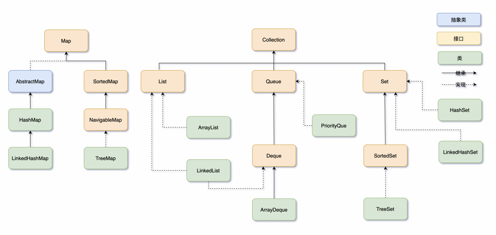

## 集合框架

## 接口-结构体系

### 顶层核心接口（框架基础）

1. **Collection<E>**：单列集合根接口，存储单个元素，定义增删查等通用方法
2. **Map<K,V>**：双列集合根接口，存储键值对（K 唯一，V 可重复），独立于 Collection 体系
3. **Iterator<E>/ListIterator<E>**：迭代器接口，负责遍历 Collection 集合，ListIterator 支持双向遍历 List

### 二、Collection 子接口及实现类（单列）

#### 1. List<E>：**有序、可重复**，支持索引访问

- 常用实现：**ArrayList**（数组实现，查询快增删慢）、**LinkedList**（链表实现，增删快查询慢，兼做队列 / 栈）、**Vector**（线程安全，数组实现，效率低，基本被 ArrayList 替代）

#### 2. Set<E>：**无序、不可重复**，无索引，底层依赖 Map 实现（值存固定对象）

- 常用实现：**HashSet**（哈希表实现，无序）、**LinkedHashSet**（链表 + 哈希表，有序）、**TreeSet**（红黑树实现，自然排序）

#### 3. Queue<E>：**队列，先进先出**，用于排队场景

- 常用实现：**ArrayDeque**（数组实现，高效）、**LinkedList**（链表实现，兼做 List/Queue）、**PriorityQueue**（优先级队列，红黑树实现）

### 三、Map 子接口及实现类（双列）

#### 核心实现（无通用子接口，直接实现 Map）

- **HashMap**：哈希表实现，无序，线程不安全，效率高（最常用）
- **LinkedHashMap**：链表 + 哈希表，有序（按插入 / 访问顺序）
- **TreeMap**：红黑树实现，按键自然排序
- **Hashtable**：哈希表实现，线程安全，效率低，已被 ConcurrentHashMap 替代
- **ConcurrentHashMap**：分段锁 / CAS 实现，线程安全，高效，适用于并发场景

### 四、辅助工具类

- **Collections**：集合工具类，提供排序、查找、同步等静态方法（如`Collections.sort(list)`）
- **Arrays**：数组工具类，支持数组转集合（`Arrays.asList()`）、数组排序等

### ArrayList

LinkedList

HashMap
